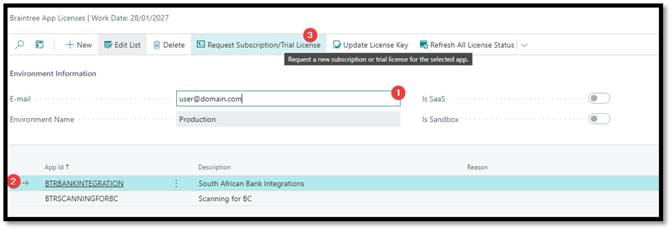
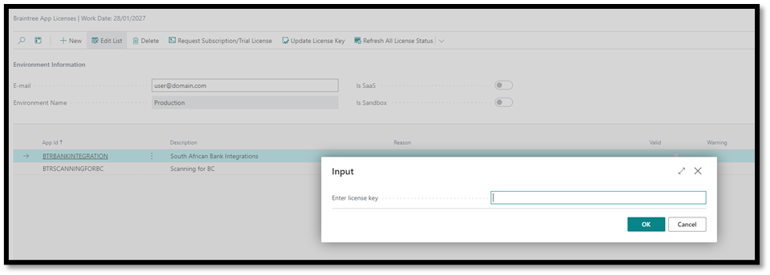

# 1 Licence Activation

In Business Central, search for and open “Braintree App Licenses”

 

1.	Enter your e-mail address
2.	Select the Scanning for BC entry
3.	Click Request Subscription/Trial License

We will activate an evaluation license and send it to the email address you specified. The mail will contain a license key. Copy that license key then return to the Braintree App Licenses.

 

1.	Select the Scanning for BC entry
2.	Click Update License Key
3.	Enter the key on the page that opens and click Ok. You should get a message that states “Thank you for registering”
