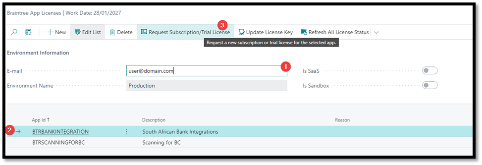
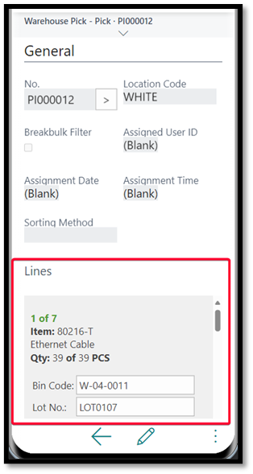
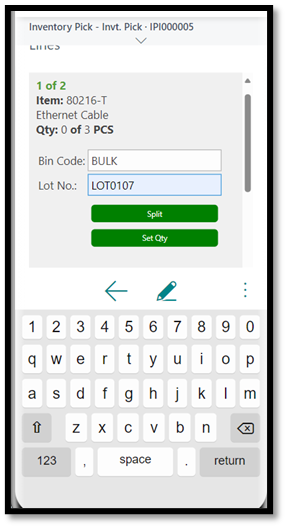

# Scanning for BC

## 1 Introduction

This application is a warehouse management and scanning solution built for Microsoft Dynamics 365 Business Central. It provides enhanced functionality for managing inventory and item tracking within a warehouse environment on a handheld device.

No additional software required, except the Microsoft Business Central app from your mobile app store.

> Assumption is that you are using a handheld scanner running Android.
> There are third-party applications available that will allow you to use the device's camera to capture and read barcodes.

We have implemented scanning in the following areas to improve productivity and reduce the amount of manual data entry.
- Warehouse Receipts
- Warehouse Shipments
- Warehouse Picks
- Warehouse Put-Aways
- Warehouse Reclassification Journal
- Warehouse Physical Inventory Journal
- Inventory Picks
- Inventory Put-Aways
- Physical Inventory Recordings
- Physical Inventory Journal

## 2. Activation

In Business Central, search for and open “Braintree App Licenses”

 

1.	Enter your e-mail address
2.	Select the Scanning for BC entry
3.	Click Request Subscription/Trial License

We will activate an evaluation license and send it to the email address you specified. The mail will contain a license key. Copy that license key then return to the Braintree App Licenses.

 

1.	Select the Scanning for BC entry
2.	Click Update License Key
3.	Enter the key on the page that opens and click Ok. You should get a message that states “Thank you for registering”

## 3. Setups

Apart from the activation, there are no required global setups, only user preferences.

| Field | Description |
| --- | --- |
| Show Mobile Controls | Displays Mobile Controls on Desktop Web Client |
| Prompt for New Item Tracking | Prompt for new Item Tracking information on Reclassification Journals. Else the original tracking info is retained. |
| Prompt for New Expiration Date | Prompt for new Expiration Date on Reclassification Journals. Else the original Expiration Date is retained. |

## 4. Processing  

### 4.1 Warehouse Receipts

|Area| Description | Screenshots |
|---|---|---|
|**Warehouse Receipts** | On a Warehouse Receipt, the user must select the line to process and click the lines section menu |  |
| | Click the Mobile Item Scanning action 1.	The Scan Area contains information about the item being scanned, like the Item No. and Description, the quantity scanned and the remaining quantity to scan. Page should be ready for scanning. 2.	List of captured tracking entries. |  |
| | Scan a tracking no. (can use manual input too)  For Lot Nos., the system will prompt user for quantity.   For Serial Nos., the system will assume quantity = 1, and thus not prompt user for input.  1.	Enter a quantity. 2.	Click Check button to save changes and create the tracking entry or Cancel button to discard the changes.|   |
| | If accepted, the following is updated: 1.	Quantity to handle 2.	Tracking List.  User can click on an entry in the tracking list and delete an entry if required. |  |
| **Warehouse Shipments** | On a Warehouse Shipment, click the lines section menu | |
| | If the location requires Picks, the button will not be displayed. This is because tracking is done from the Pick and item tracking cannot be assigned from the warehouse shipment when picks are required. |  |
| | If the location does not require Pick, the button will be displayed  Scanning process continues same as with Warehouse Receipts. |  | 
| **Warehouse Picks**| On warehouse picks, the standard lines section is hidden on mobile devices and a mobile friendly section is displayed.   Currently caters for source documents Sales Order and Transfer Order.  When a tracking no. is captured, the system will check the bin contents and assign the available quantity to pick.  If there isn’t enough to cover the outstanding quantity, the split function should be used to scan a tracking no. from another bin. |  |
| | Split function: If available, user can click the split button. This will prompt the user to enter a value for the Qty. to Handle field.  Accepting the changes sets the Quantity on the current line to the same as the Qty. to Handle and creates a new line for the difference between the original Quantity and the new Quantity. Set Qty. function: If available, allows the user to capture a new value for the Qty. to Handle field. |  |
| **Warehouse Put-Aways** | On Warehouse Put-Aways, the only field that can be modified is the Bin Code. Currently caters for source documents Purchase Order and Transfer Order |  |
| **Inventory Picks** | Inventory Picks function the same as Warehouse Picks |  | 
| **Inventory Put-Aways** | Inventory Put-Aways function more-or-less the same as Warehouse Put-Aways, with the exception that it is possible to capture tracking information in addition to the bin code. |  |
| | After capturing the tracking no. it will prompt the user for a Qty. to Handle. The default value will be the Outstanding Quantity. |  | 
| **Physical Inventory Recordings** | On Physical Inventory Recordings, the standard lines section is hidden on mobile devices and a mobile friendly section is displayed. |  | 
| | After capturing the tracking no. it will prompt the user for a Qty. to Handle. The default value will be the Outstanding Quantity. For non-tracked items, Set Qty. function can be used. |  |

## 5. Troubleshooting
If you encounter any issues or errors while using the Scanning for BC extension please contact Braintree support, providing details such as error messages and the steps leading to the problem for efficient troubleshooting.

Email: bcsupport@braintree.co.za

